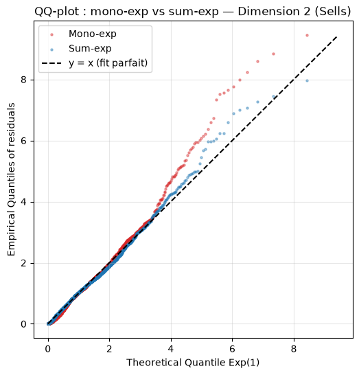
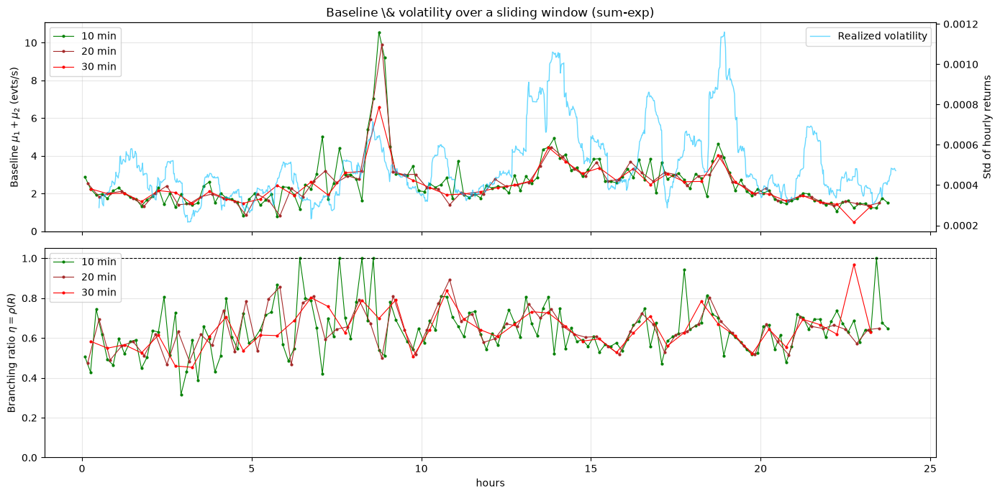

# Bivariate Hawkes modelling of Bitcoin order flow

Maximum-likelihood estimation, goodness-of-fit testing and endogeneity
measurement for the arrival dynamics of Bitcoin market orders, using
bivariate Hawkes processes with exponential and sum-of-exponentials kernels.

---

## Abstract

We model the arrival dynamics of Bitcoin market orders with a bivariate Hawkes
process whose excitation kernel is a sum of exponentials. After recalling the
continuous-time theory (point processes, conditional intensity, self-excitation),
we derive the maximum-likelihood estimator and give a closed-form,
$O(k)$-computable log-likelihood for the univariate, bivariate and
sum-of-exponentials cases, exploiting the Markovian structure of exponential
kernels. We then detail an exact simulation scheme and discuss stationarity and
asymptotic behaviour.

---

## Motivation

A Hawkes process is a point process characterised by **self-excitation**: a past
event temporarily raises the probability of future events. This is a natural fit
for market **reflexivity** — the endogeneity of price moves, driven in particular
by agent herding — where a price drop can trigger a cascading decline. A
homogeneous Poisson process cannot capture this: its increments over disjoint
intervals are independent and stationary, and its intensity is constant in time.

The kernel governs how the excitation from an event decays, acting as a memory
mechanism. Financial markets exhibit **long memory**, which ideally calls for a
power-law kernel; but that choice makes the likelihood computationally
intractable. A single exponential kernel captures only part of this memory yet
keeps the intensity **Markovian**, which makes the likelihood cheap to evaluate.
We adopt a compromise — a **sum-of-exponentials kernel** — which preserves the
Markovian property while approximating power-law decay.

In its **bivariate** form the two counting processes are driven simultaneously by
their own past and by the other component's events. Applied to buy/sell market
orders, this captures four impact channels: buy→buy and sell→sell
self-excitation, plus buy↔sell **cross-excitation** (e.g. panic amplifying sells
and spilling onto the buy side).

We study **Bitcoin** for two reasons: its high volatility with no institutional
circuit breakers favours cascading dynamics, and its massive algorithmic order
volume yields a particularly rich microstructure. 

The full paper containing all mathematical derivations is available on my LinkedIn profile, 
or you can request a copy directly via email at maxime.skryma@gmail.com
---

## What this project does

- **Estimation.** MLE of bivariate Hawkes parameters for two kernels:
  a single exponential (`neg_log_likelihood_bivariate`) and a sum of two
  exponentials (`neg_log_likelihood_bivariate_sum_exp`), each with a closed-form
  $O(k)$ log-likelihood exploiting the exponential kernel's Markovian recursion.
  Optimisation uses `scipy` `trust-constr` under stationarity constraints
  (spectral radius of the branching matrix $< 1$).

- **Goodness of fit.** Residual analysis via the **time-change theorem**: under a
  correct model the compensator increments $u = \Delta\Lambda$ between consecutive
  events are i.i.d. $\mathrm{Exp}(1)$. Three tests are applied per dimension:
  - **KS** — Kolmogorov–Smirnov against $\mathrm{Exp}(1)$ (marginal law),
  - **LB** — Ljung–Box at 20 lags (residual autocorrelation),
  - **ER** — Engle–Russell excess-dispersion test (over-dispersion).

- **Pass rates by window size.** Random windows of several sizes (5/10/20/… min)
  are fitted across the full day; the fraction passing each test is reported,
  together with the mean test statistics
  (`compare_kernels_by_window_size`).

- **Endogeneity across the day.** Sliding-window estimation of the baseline
  intensity $\mu$ and the branching ratio $\eta = \rho(R)$ along the session,
  for both kernels (`plot_params_across_day`), in the spirit of the reflexivity
  literature.

- **Simulation cross-check.** Exact simulation of the fitted process (via the
  `tick` library) to compare synthetic order flow against the real one.

---
| Figure | File | Content |
|---|---|---|
| QQ-plot, buys | `src/btc_results/fig_01.png` | residual quantiles, mono vs sum |
| QQ-plot, sells | `src/btc_results/fig_02.png` | residual quantiles, mono vs sum |
| Sliding Window for Mono-Exp | `src/btc_results/fig_03.png` | Plot of mono-exp on sliding different sizes windows  |
| Sliding Window for Sum-Exp | `src/btc_results/fig_04.png` | Plot of sum-exp on sliding different sizes windows |
| Pass-Rates and t-values | `src/btc_results/results_summary.txt` | Table of all pass-rates over different window sizes |




---

## Repository structure

```
Spread_Crypto/
├── data/
│   └── binance_trades_2026-09-01_BTCUSDT.csv.gz   # Tardis/Binance trades
├── src/
│   ├── data.py         # preprocessing: raw trades -> signed buy/sell point process
│   ├── model.py        # Hawkes likelihoods, MLE, residuals, GoF tests, simulation
│   ├── main.py         # end-to-end pipeline -> figures + results_summary.txt
│   └── btc_results/    # generated outputs (figures, summary)
├── notebooks/
│   ├── BTC_Hawkes.ipynb   # exploratory analysis on BTC data
│   └── sim_hawkes.ipynb   # simulation studies / sanity checks
├── market_making/      # (WIP) market-making under Hawkes order flow — see its own README
├── requirements.txt
└── README.md
```

### Key modules

- **`data.py`** — `build_hawkes_dataframe` aggregates raw trades into a unique-time
  signed series (`side = 1` buy / `0` sell, majority vote per timestamp;
  timestamps converted µs → s and re-based to 0); `extract_time_window`,
  `initialize_hawkes_params`, `initialize_hawkes_params_sum_exp`.

- **`model.py`** — likelihoods and fits (`fit_bivariate`, `fit_bivariate_sum_exp`),
  residuals via time-change (`hawkes_residuals_bivariate*`), GoF
  (`bivariate_goodness_of_fit*`, `engle_russell_ed_test`), window pass-rates
  (`compare_kernels_by_window_size`), rolling endogeneity
  (`estimate_params_rolling`, `plot_params_across_day`), plotting (`qq_overlay`).

- **`main.py`** — `run_real_data(...)` runs the whole study on one day and writes
  figures + a text summary to `out_dir`.

---

## Data

Binance BTC/USDT **trades** for 2026-09-01, downloaded via
[`tardis-dev`](https://pypi.org/project/tardis-dev/). Relevant columns:
`timestamp` (epoch **microseconds**), `side` (`buy`/`sell`), `price`, `amount`.

The point process modelled here is the **signed trade-arrival** process, not
mid-price changes — see *Limitations* for why this matters when comparing to the
literature.

---

## Installation & usage

Requires Python ≥ 3.11.

```bash
pip install -r requirements.txt
```

Run the full pipeline (from `src/`):

```bash
cd src
python main.py
```

Outputs are written to `src/btc_results/` (`fig_*.png` + `results_summary.txt`).
Key arguments of `run_real_data` (in `main.py`):

- `window_start` / `window_end` — the reference window (UTC) for the global fit
  and QQ-plots;
- `win_sizes` — window sizes for the pass-rate study across the day;
- `roll_sizes` — window sizes for the sliding-window $\mu$ / $\eta$ analysis.

> **Note.** The sliding-window analysis fits one Hawkes model per window across
> the whole day; the sum-of-exponentials kernel (14 parameters) is the heaviest
> part. Start with a single `roll_sizes=(30,)` to validate the run before
> launching the full configuration.

---

## Limitations & next steps

- **Object of study.** This project models **signed trade arrivals** (bivariate),
  whereas much of the reference literature (e.g. Mark et al.) models **mid-price
  changes** (univariate). Trade flow is denser, burstier and more endogenous, so
  pass rates are not directly comparable; reproducing the univariate mid-price
  case is the cleanest way to validate the implementation against published
  numbers.

- **Kernel.** The exponential/sum-exp kernels are Markovian by design but only
  approximate the market's long memory; a **power-law** kernel is the natural next
  step (it improves fit in the literature at the cost of tractability).

- **Stationarity.** The Hawkes MLE assumes constant parameters within a window;
  results favour short windows, and longer windows blend regimes.

- **Market making (WIP).** `market_making/` explores optimal quoting under Hawkes
  order flow (Avellaneda–Stoikov and Guéant–Lehalle–Tapia baselines, then Deep
  RL); see `market_making/README.md`.

---

## References

- P. Hawkes (1971), *Spectra of some self-exciting and mutually exciting point
  processes.*
- E. Bacry, I. Mastromatteo, J.-F. Muzy (2015), *Hawkes processes in finance.*
- Mark et al., *Quantifying endogeneity of cryptocurrency markets*
  (exponential vs power-law kernels for mid-price changes).
- M. Avellaneda, S. Stoikov (2008), *High-frequency trading in a limit order book.*
- O. Guéant, C.-A. Lehalle, J. Fernandez-Tapia (2012), *Dealing with the inventory
  risk: a solution to the market making problem.*
- `tick` — E. Bacry et al., *tick: a Python library for statistical learning.*
